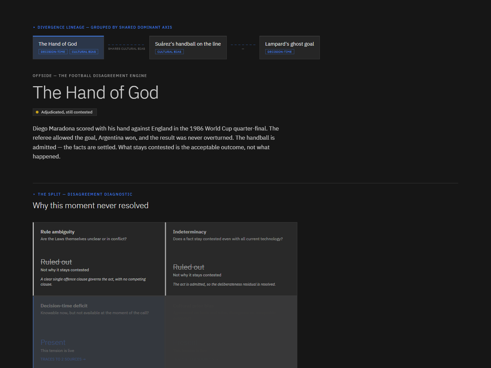
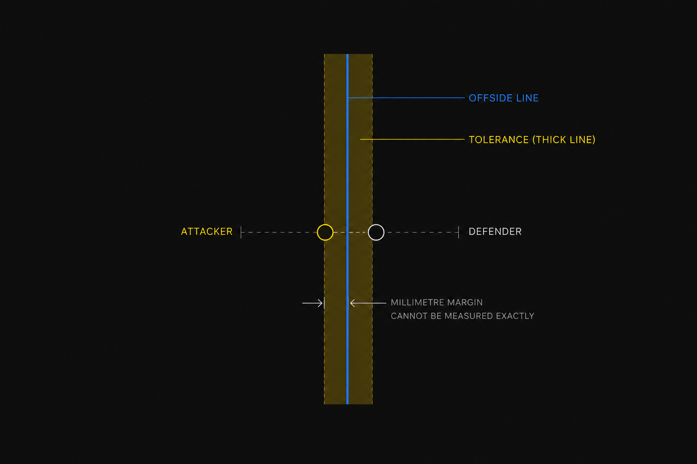
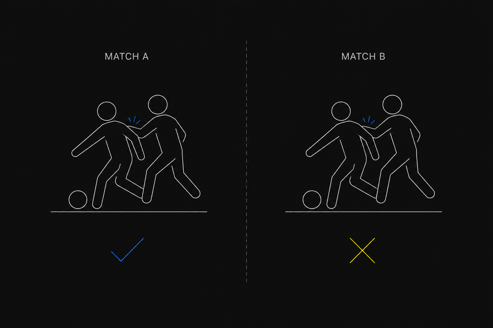
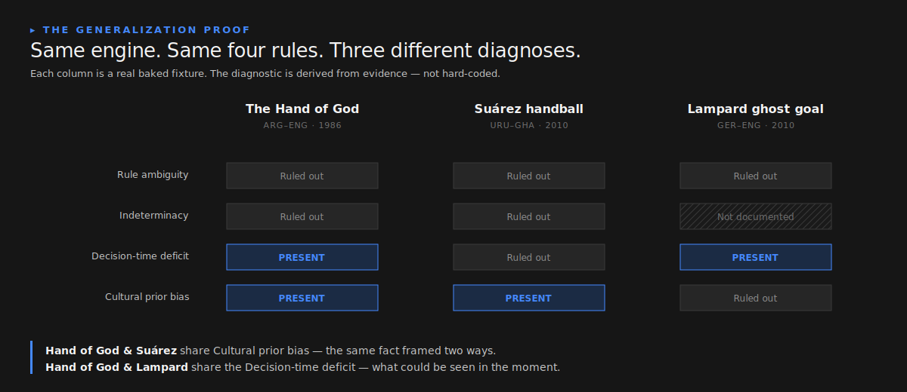
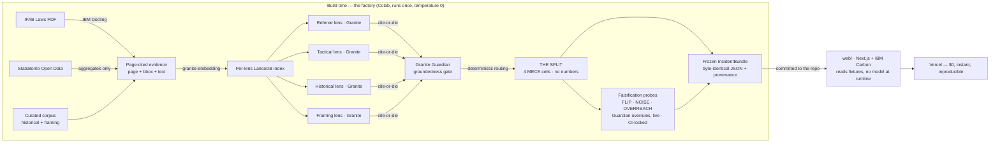

<div align="center">


### The Football Disagreement Engine

**Every football AI tells you *whether* a call was right. OFFSIDE tells you *why* the
argument never ends — and proves every reason against the real Laws of the Game.**

[](https://offside-june-2026.vercel.app/)

[](https://github.com/vighriday/offside-june-2026/actions/workflows/ci.yml)
[](LICENSE)
[](.python-version)
[](web/package.json)
[](#built-with-ibm)

*An explainable multi-agent engine, grounded in the real Laws of the Game, that
decomposes any contested refereeing decision — the 1986 Hand of God or **this season's
VAR disputes** — into the precise structural reasons the argument persists: the rules,
what stays inherently uncertain, what was knowable at the time, and who's watching.*

<br/>



</div>

---

## At a glance

|  |  |
|--|--|
| **What** | For any contested refereeing decision, it decomposes **why the disagreement persists** across four fixed, evidence-grounded dimensions — never whether the call was correct. |
| **Why it's different** | Today's football AI (X-VARS, SoccerRef-Agents) chases **correctness**. OFFSIDE decomposes **disagreement persistence** — an unclaimed lane. *We don't adjudicate; we decompose.* |
| **Who it's for** | Not fans re-litigating a goal, but the people who **defend and write these decisions** — referees' bodies, IFAB/PGMOL, and the broadcasters who explain them. It shows *which structural gap* a controversy exposes, and lets you compare them across a season. |
| **Current, not trivia** | Six incidents — one iconic hook, then **three live, unsettled disputes from the current Laws and season**: the rewritten handball Law, the millimetre semi-automated offside line, and the "subjective" VAR calls that flip week to week. Across the set, *all four* dimensions fire. |
| **The trust spine** | Every cell clicks straight through to a real, page-numbered passage of the actual IFAB Laws of the Game. A second IBM model (Granite Guardian) audits the first and demotes anything it can't ground — and a **live falsification engine** lets you watch Guardian overrule the first model on demand, integrity-locked in CI so the audit can't be faked. Where there's no evidence, it says so. |
| **The moat** | The reasoning model is **structurally incapable of emitting a number** — no fabricated percentages, ever. Enforced by a test in CI. |
| **Built with** | IBM Granite · IBM Docling · Granite Embedding · **Granite Guardian** · **LangGraph** · **Context Forge (MCP)** · Langflow · RAGAS audit |

**[► Open the live demo](https://offside-june-2026.vercel.app/)** — try clicking a cell, then switch incidents to watch the diagnosis change. New here? The **[90-second judge's guide](JUDGE.md)** walks the five things worth trying.

---

## The problem

Billions watch the same match and experience it completely differently. The same
four seconds — Maradona's hand, 1986 — is *"the greatest goal in history"* in Buenos
Aires and *"he cheated"* in London. Both certain. Both internally consistent.

And it is not nostalgia. **This season**, the same structural fight plays out live: the
2024/25 handball Law still asks officials to choose between three different tests for the
same contact; semi-automated offside draws a line to the millimetre that the authorities
themselves blur because it cannot be measured that finely; and a PGMOL panel logs
week-to-week contradictions as "subjective decisions" that are not even counted as errors.
The 2026 World Cup will run on exactly these Laws and this technology.

Today's football AI tells you **what happened** and adjudicates **whether a call was
correct**. OFFSIDE answers the question nobody else does:

> **Why do informed, intelligent people look at the same incident and refuse to
> agree — and why does that disagreement persist?**

That makes it a tool for the people who have to *defend* these decisions, not just argue
them: it names which of four structural gaps a controversy exposes, and — because the
diagnosis is computed, not written — lets a referees' body or rule-maker see the **pattern
across many incidents**, not one row at a time.

## THE SPLIT

OFFSIDE reconstructs a contested moment through four evidence-grounded lenses and
decomposes the disagreement into a single artifact — **THE SPLIT** — that attributes
*why it stays contested* across four fixed, mutually-exclusive dimensions:

| Dimension | The question it answers |
|-----------|-------------------------|
| **Rule ambiguity** | Are the Laws themselves unclear or in conflict? |
| **Indeterminacy** | Does a fact stay contested even with all current technology? |
| **Decision-time deficit** | Knowable now, but not available at the moment of the call? |
| **Cultural prior bias** | Agreement on facts and rules, divergence on the acceptable outcome? |

For the Hand of God, THE SPLIT resolves to a precise diagnosis — **it stays debated not
because the Law is unclear, and not because the act is unknowable, but because of what the
referee could see and which nation is watching** (the animated diagnostic above shows it
resolving). Here it is live:



Each cell click-traces to a specific, page-numbered passage of the actual source — the
**IFAB Laws of the Game**, StatsBomb event data, the curated historical record, or a
named quote. Where there is no evidence, OFFSIDE says so explicitly, in its own cell
state (`NOT_DOCUMENTED`), rather than guessing.

### It generalizes — the proof it isn't hard-coded

Switch incidents on the live site and THE SPLIT *changes*. Six real incidents produce six
distinct signatures from the same engine and the same four rules — and across the set,
**every one of the four dimensions fires**, which is the proof the framework is
load-bearing rather than decorative:

| Incident | Rule | Indeterminacy | Decision-time | Cultural | What it shows |
|----------|:----:|:----:|:----:|:----:|----|
| **Hand of God** (1986) | ○ | ○ | ● | ● | unseen handball + nation-vs-nation |
| **Modern handball Law** *(live)* | ● | · | ○ | ○ | the **rulebook itself** has competing tests |
| **Millimetre offside** *(live)* | ○ | ● | ○ | ○ | the **truth is unmeasurable** at the margin |
| **"Subjective" VAR call** *(live)* | ● | · | ○ | ● | fuzzy threshold **and** each side reads it its way |
| **Suárez** (2010) | ○ | ○ | ○ | ● | seen + correctly called, pure framing split |
| **Lampard** (2010) | ○ | · | ● | ○ | knowable now, unavailable then; sides agreed |

*(● present · ◐ weak · ○ ruled out · · not documented)*

The archive incidents alone only ever lit *Decision-time* and *Cultural bias*; the three
**current** disputes are what make *Rule ambiguity* and *Indeterminacy* fire — pointing the
same engine at live, unsettled problems instead of settled trivia. Each incident ships a
schematic of the disputed moment, so you *see* it before you read it:

| The modern handball Law | The millimetre offside line | The "subjective" VAR call |
|:--:|:--:|:--:|
|  |  |  |
| RULE AMBIGUITY · present | INDETERMINACY · present | RULE + CULTURAL · present |



The app surfaces this directly: a **Divergence Lineage** at the top groups the incidents
by their shared dominant axis and marks the live ones, and switching between them animates
the change.

### Run the real engine, live

The deployed site reads frozen fixtures (static hosting has no GPU). The other half — the
proof this is a *system*, not six hand-written answers — is a one-command live run that
executes the actual four-model pipeline on any incident and narrates every step:

```bash
# with Ollama serving the three IBM models (granite3.3:8b, granite-embedding:30m, granite3-guardian:2b)
python engine/scripts/analyze_live.py --incident offside-margin
```

It retrieves each lens's evidence, has Granite read it, has **Granite Guardian audit each
reading**, routes the surviving evidence onto THE SPLIT, and prints the diagnosis — with no
number anywhere. Point it at an incident and watch the four axes fall out of the evidence.

### The falsification engine — the system attacks its own answer

A frozen diagnosis could be mistaken for a lookup table. So OFFSIDE is built to **attack
its own result**, live, through the same two IBM models — and the millimetre-offside
incident ships three probes that do exactly that:

| Probe | What it feeds the engine | What happens | What it proves |
|-------|--------------------------|--------------|----------------|
| **Push it the right way** | a grounded record saying the line is now perfectly measurable | the engine moves the axis **off** "unknowable" | it reasons from evidence, not a stored answer |
| **Push it with junk** | an irrelevant passage | nothing moves | it doesn't flip at any push — the negative control holds |
| **Lie to it** | a claim the sources can't support | **Granite Guardian returns `UNGROUNDED`** and overrules the first model | the second IBM model audits, live, and rejects what the evidence doesn't carry |

Every verdict is a **real captured Granite Guardian token**. A CI integrity lock
([`bake/integrity.py`](engine/offside_engine/bake/integrity.py)) fails the build if any probe
verdict is hand-authored, or if a probe didn't actually do what its kind claims — so the
audit is impossible to fake. Bake it live, or it doesn't ship.

```bash
python engine/scripts/analyze_live.py --incident offside-margin --probe
```

This is the Trust & Transparency claim made concrete: hand a skeptic the attack, and the
engine holds — because a second IBM model is checking the first, on camera.

## The moat: a model that cannot fabricate a number

The reasoning model is **structurally forbidden from emitting a number**. The schemas it
is constrained to — THE SPLIT, the lens readings — contain no numeric field anywhere in
their transitive shape. There is no `73%` to invent because there is no number-shaped
hole to fill. THE SPLIT communicates with *states* (`PRESENT` / `WEAK` / `RULED OUT` /
`NOT_DOCUMENTED`), never with a bar that could be misread as a confidence. This invariant
is enforced by a test that walks the full JSON Schema and fails the build on any numeric
type — the guarantee is checked by CI, not by good intentions.

## How it works

OFFSIDE is a **factory**, not a live service. Everything expensive happens once, at build
time on a GPU; the web app is a pure reader of the frozen result — no model, no Python,
no vector store at runtime.



Granite reads each lens's evidence (cite-or-die); Granite Guardian audits those readings;
then **deterministic code** assigns the four diagnostic axes from the gated evidence. The
routing is code, not a model emission — which is exactly what keeps THE SPLIT reproducible
and the model unable to fabricate a magnitude. The fixture is deterministic: re-running
the bake on the same corpus produces a byte-identical file, and every fixture carries its
own provenance (the models used and the corpus git SHA) so any result can be reproduced.

## Built with IBM

Seven tools, each load-bearing — not decoration:

| Tool | What it does | Where a judge sees it |
|------|--------------|------------------------|
| **IBM Granite** (`granite3.3:8b`) | Reads each lens's evidence into a grounded, cite-or-die natural-language finding — never a verdict, never a number | The lens panels under THE SPLIT |
| **IBM Docling** | Extracts the IFAB Laws into structured, page-cited evidence (page + bounding box) — the click-to-source spine | Click any cell → the cited IFAB page and passage |
| **Granite Embedding** (`granite-embedding:30m`) | Turns evidence into a searchable form so each lens retrieves only its own (Laws for Referee, event data for Tactical, …) | Silent infrastructure — it's *why* the lenses disagree |
| **Granite Guardian** (`granite3-guardian:2b`) | A **second IBM model audits the first** — it checks each reading's groundedness against its cited page and demotes anything it cannot confirm | The "Granite Guardian: grounded" seal on each lens panel |
| **LangGraph** | The bake as an **executable** `StateGraph` — four lens nodes fan out, converge on routing, gate, and assemble; a test proves it yields the identical SPLIT as the direct bake | [`orchestrate/graph.py`](engine/offside_engine/orchestrate/graph.py), [`flows/bake_graph.mmd`](flows/bake_graph.mmd) |
| **IBM Context Forge** (MCP) | The engine exposed as an **agent-callable MCP tool** (`decompose_disagreement`) behind the IBM MCP gateway — OFFSIDE as a reusable capability, not just a site | [`mcp_server.py`](engine/offside_engine/mcp_server.py), [`flows/context_forge.md`](flows/context_forge.md) |
| **Langflow** | The same pipeline as an importable visual canvas | [`flows/offside_pipeline.json`](flows/offside_pipeline.json) |

Plus a build-time **RAGAS / groundedness audit** ([`eval/groundedness.py`](engine/offside_engine/eval/groundedness.py)) that scores how grounded each lens reading is — written to [`a report`](engine/data/eval/groundedness_report.md), never into THE SPLIT or the UI, so the no-numbers moat stays intact.

The **Granite Guardian gate** is the move a single-model entry cannot make: a lens reading
survives only if the first model asserted it **and** the second model could not refute it
against the source. The audit is recorded as a trust seal, frozen at temperature 0. Every
shipped fixture is baked **live** through the real models — `granite3.3:8b` reads each lens
and `granite3-guardian:2b` audits each — so the seals you see on the site are genuine
captured verdicts, not placeholders. The four SPLIT axes are then assigned from that gated
evidence by deterministic, documented rules (a pure function of the lens signatures), which
is what keeps the diagnosis reproducible and the model unable to fabricate a magnitude.

> Built using **IBM Project Bob** (Architect and Code modes) during development — the
> architecture and engine were shaped with Bob and reviewed for issues along the way. Bob
> is part of how this was built, not a runtime component of the product.

## Prior art & the wedge

X-VARS (arXiv 2404.06332) and SoccerRef-Agents both chase **correctness**; stance
detection and argument mining are established NLP. OFFSIDE's narrow, defensible novelty is
**structural attribution of disagreement *persistence*, grounded in the real IFAB corpus,
with a verdict-free temporal contrast.** *X-VARS tells you it was handball. OFFSIDE tells
you why an Argentine pundit, an English keeper, and a neutral analyst will never agree.*

## Repository

```text
engine/     Python build-time factory (the bake) — 145 tests, runs on Colab or locally via Ollama
  bake.ipynb         the cloud factory runner (pulls the Granite models, bakes a fixture)
  scripts/bake_local.py   the offline deterministic baker (no GPU; reproducible fixtures)
  offside_engine/    the pipeline: ingest → index → retrieve → lenses → guardian → split
web/        Next.js 16 + IBM Carbon app — reads the frozen fixtures, deploys to Vercel
  fixtures/  the baked, audited IncidentBundle JSON the app renders
corpus/     curated evidence (framing quotes, historical record) as YAML
flows/      the Langflow pipeline graph
docs/       architecture notes
```

## Running it

**Requirements:** Python 3.12 (pinned in [`.python-version`](.python-version)),
Node 22 (pinned in [`.nvmrc`](.nvmrc)).

**Just view it** — the [live demo](https://offside-june-2026.vercel.app/) is the fastest path.

**Run the web app locally** (reads the pre-baked fixtures — no model or GPU needed):

```bash
cd web
npm install
npm run dev      # http://localhost:3000
```

**Re-bake a fixture** (optional, needs a GPU) — open [`engine/bake.ipynb`](engine/bake.ipynb)
on Google Colab with a T4, run all cells. It installs Ollama, pulls the three Granite
models, and writes an audited bundle into `web/fixtures/`. A *fixture* is a pre-computed,
audited analysis snapshot — the app renders it verbatim. The offline baker
([`engine/scripts/bake_local.py`](engine/scripts/bake_local.py)) produces the same
fixtures deterministically without a GPU.

**Run the engine tests:**

```bash
cd engine
pip install -e ".[dev]"
pytest -q          # 145 tests, incl. the no-numbers moat, cite-or-die guards, and the probe integrity lock
```

## License

Source code: [MIT](LICENSE). Data sources (StatsBomb Open Data, the IFAB Laws of the
Game, IBM Granite) are governed by their own separate terms — see
[LICENSES.md](LICENSES.md). StatsBomb attribution is shown on the Tactical lens card in
the app, per the StatsBomb User Agreement.
