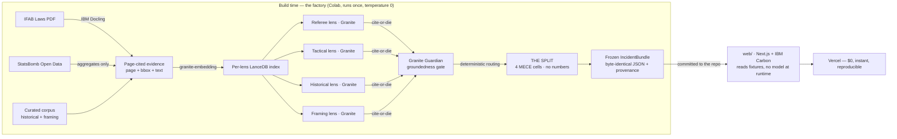

<div align="center">

# OFFSIDE

### The Football Disagreement Engine

**OFFSIDE doesn't tell you whether the referee was right — it shows you, with the
receipts, exactly *why* a billion people will never agree.**

[](https://offside-june-2026.vercel.app/)

[](https://github.com/vighriday/offside-june-2026/actions/workflows/ci.yml)
[](LICENSE)
[](.python-version)
[](web/package.json)
[](#built-with-ibm)

*An explainable multi-agent engine, grounded in the real Laws of the Game, that
decomposes football's most contested moments into the precise reasons people disagree —
the rules, what stays inherently uncertain, what was knowable at the time, and who's
watching.*

</div>

---

## At a glance

|  |  |
|--|--|
| **What** | For a contested football moment, it decomposes **why the disagreement persists** across four fixed, evidence-grounded dimensions — never whether the call was correct. |
| **Why it's different** | Today's football AI (X-VARS, SoccerRef-Agents) chases **correctness**. OFFSIDE decomposes **disagreement persistence** — an unclaimed lane. *We don't adjudicate; we decompose.* |
| **The trust spine** | Every cell of the diagnostic clicks straight through to a real, page-numbered passage of the actual IFAB Laws of the Game. Where there's no evidence, it says so. |
| **The moat** | The reasoning model is **structurally incapable of emitting a number** — no fabricated percentages, ever. Enforced by a test in CI. |
| **Built with** | IBM Granite · IBM Docling · Granite Embedding · **Granite Guardian** · Langflow |

**[► Open the live demo](https://offside-june-2026.vercel.app/)** — try clicking a cell, then switch incidents to watch the diagnosis change.

---

## The problem

Billions watch the same match and experience it completely differently. The same
four seconds — Maradona's hand, 1986 — is *"the greatest goal in history"* in Buenos
Aires and *"he cheated"* in London. Both certain. Both internally consistent.

Today's football AI tells you **what happened** and adjudicates **whether a call was
correct**. OFFSIDE answers the question nobody else does:

> **Why do informed, intelligent people look at the same incident and refuse to
> agree — and why does that disagreement persist?**

## THE SPLIT

OFFSIDE reconstructs a contested moment through four evidence-grounded lenses and
decomposes the disagreement into a single artifact — **THE SPLIT** — that attributes
*why it stays contested* across four fixed, mutually-exclusive dimensions:

| Dimension | The question it answers |
|-----------|-------------------------|
| **Rule ambiguity** | Are the Laws themselves unclear or in conflict? |
| **Indeterminacy** | Does a fact stay contested even with all current technology? |
| **Decision-time deficit** | Knowable now, but not available at the moment of the call? |
| **Cultural prior bias** | Agreement on facts and rules, divergence on the acceptable outcome? |

For the Hand of God, THE SPLIT resolves to a precise diagnosis:

```text
            THE SPLIT — Why This Moment Never Resolved

   Rule ambiguity         ▰ RULED OUT     the Law is clear
   Indeterminacy          ▰ RULED OUT     the act is admitted, so knowable
   Decision-time deficit  ▰ PRESENT  ◀    what the referee could see
   Cultural prior bias    ▰ PRESENT  ◀    which nation is watching

   By the rules: settled. To half the world: never.
   Not unclear law — what the ref could see, and who was watching.
```

Each cell click-traces to a specific, page-numbered passage of the actual source — the
**IFAB Laws of the Game**, StatsBomb event data, the curated historical record, or a
named quote. Where there is no evidence, OFFSIDE says so explicitly, in its own cell
state (`NOT_DOCUMENTED`), rather than guessing.

### It generalizes — the proof it isn't hard-coded

Switch to **Lampard's ghost goal (2010)** on the live site and THE SPLIT *changes*: the
Cultural-Prior-Bias cell flips from PRESENT to **RULED OUT** — nearly everyone, including
German voices, agreed the ball was over the line, so there is no opposed framing. Same
engine, same four rules, a different diagnosis — because the evidence differs. That
contrast is the proof the diagnostic is *derived*, not pre-written.

## The moat: a model that cannot fabricate a number

The reasoning model is **structurally forbidden from emitting a number**. The schemas it
is constrained to — THE SPLIT, the lens readings — contain no numeric field anywhere in
their transitive shape. There is no `73%` to invent because there is no number-shaped
hole to fill. THE SPLIT communicates with *states* (`PRESENT` / `WEAK` / `RULED OUT` /
`NOT_DOCUMENTED`), never with a bar that could be misread as a confidence. This invariant
is enforced by a test that walks the full JSON Schema and fails the build on any numeric
type — the guarantee is checked by CI, not by good intentions.

## How it works

OFFSIDE is a **factory**, not a live service. Everything expensive happens once, at build
time on a GPU; the web app is a pure reader of the frozen result — no model, no Python,
no vector store at runtime.



Granite reads each lens's evidence (cite-or-die); Granite Guardian audits those readings;
then **deterministic code** assigns the four diagnostic axes from the gated evidence. The
routing is code, not a model emission — which is exactly what keeps THE SPLIT reproducible
and the model unable to fabricate a magnitude. The fixture is deterministic: re-running
the bake on the same corpus produces a byte-identical file, and every fixture carries its
own provenance (the models used and the corpus git SHA) so any result can be reproduced.

## Built with IBM

Five IBM tools, each load-bearing — not decoration:

| Tool | What it does | Where a judge sees it |
|------|--------------|------------------------|
| **IBM Granite** (`granite3.3:8b`) | Reads each lens's evidence into a grounded, cite-or-die natural-language finding — never a verdict, never a number | The lens panels under THE SPLIT |
| **IBM Docling** | Extracts the IFAB Laws into structured, page-cited evidence (page + bounding box) — the click-to-source spine | Click any cell → the cited IFAB page and passage |
| **Granite Embedding** (`granite-embedding:30m`) | Turns evidence into a searchable form so each lens retrieves only its own (Laws for Referee, event data for Tactical, …) | Silent infrastructure — it's *why* the lenses disagree |
| **Granite Guardian** (`granite3-guardian:2b`) | A **second IBM model audits the first** — it checks each reading's groundedness against its cited page and demotes anything it cannot confirm | The "Granite Guardian: grounded" seal on each lens panel |
| **Langflow** | The bake pipeline as an importable visual graph (evidence → 4 lenses → Guardian → THE SPLIT) | [`flows/offside_pipeline.json`](flows/offside_pipeline.json) — import into Langflow Studio |

The **Granite Guardian gate** is the move a single-model entry cannot make: a lens reading
survives only if the first model asserted it **and** the second model could not refute it
against the source. The audit is recorded as a trust seal, frozen at temperature 0. (The
SPLIT cells themselves are then assigned by deterministic code, so their seals record
`deterministic-router` — the routing is faithful and reproducible, never an overclaim that
a model audited them.)

> Built using **IBM Project Bob** (Architect and Code modes) during development — the
> architecture and engine were shaped with Bob and reviewed for issues along the way. Bob
> is part of how this was built, not a runtime component of the product.

## Prior art & the wedge

X-VARS (arXiv 2404.06332) and SoccerRef-Agents both chase **correctness**; stance
detection and argument mining are established NLP. OFFSIDE's narrow, defensible novelty is
**structural attribution of disagreement *persistence*, grounded in the real IFAB corpus,
with a verdict-free temporal contrast.** *X-VARS tells you it was handball. OFFSIDE tells
you why an Argentine pundit, an English keeper, and a neutral analyst will never agree.*

## Repository

```text
engine/     Python build-time factory (the bake) — 118 tests, runs on Colab
  bake.ipynb         the cloud factory runner (pulls the Granite models, bakes a fixture)
  scripts/bake_local.py   the offline deterministic baker (no GPU; reproducible fixtures)
  offside_engine/    the pipeline: ingest → index → retrieve → lenses → guardian → split
web/        Next.js 16 + IBM Carbon app — reads the frozen fixtures, deploys to Vercel
  fixtures/  the baked, audited IncidentBundle JSON the app renders
corpus/     curated evidence (framing quotes, historical record) as YAML
flows/      the Langflow pipeline graph
docs/       architecture notes
```

## Running it

**Requirements:** Python 3.12 (pinned in [`.python-version`](.python-version)),
Node 22 (pinned in [`.nvmrc`](.nvmrc)).

**Just view it** — the [live demo](https://offside-june-2026.vercel.app/) is the fastest path.

**Run the web app locally** (reads the pre-baked fixtures — no model or GPU needed):

```bash
cd web
npm install
npm run dev      # http://localhost:3000
```

**Re-bake a fixture** (optional, needs a GPU) — open [`engine/bake.ipynb`](engine/bake.ipynb)
on Google Colab with a T4, run all cells. It installs Ollama, pulls the three Granite
models, and writes an audited bundle into `web/fixtures/`. A *fixture* is a pre-computed,
audited analysis snapshot — the app renders it verbatim. The offline baker
([`engine/scripts/bake_local.py`](engine/scripts/bake_local.py)) produces the same
fixtures deterministically without a GPU.

**Run the engine tests:**

```bash
cd engine
pip install -e ".[dev]"
pytest -q          # 118 tests, incl. the no-numbers moat + cite-or-die guards
```

## License

Source code: [MIT](LICENSE). Data sources (StatsBomb Open Data, the IFAB Laws of the
Game, IBM Granite) are governed by their own separate terms — see
[LICENSES.md](LICENSES.md). StatsBomb attribution is shown on the Tactical lens card in
the app, per the StatsBomb User Agreement.
